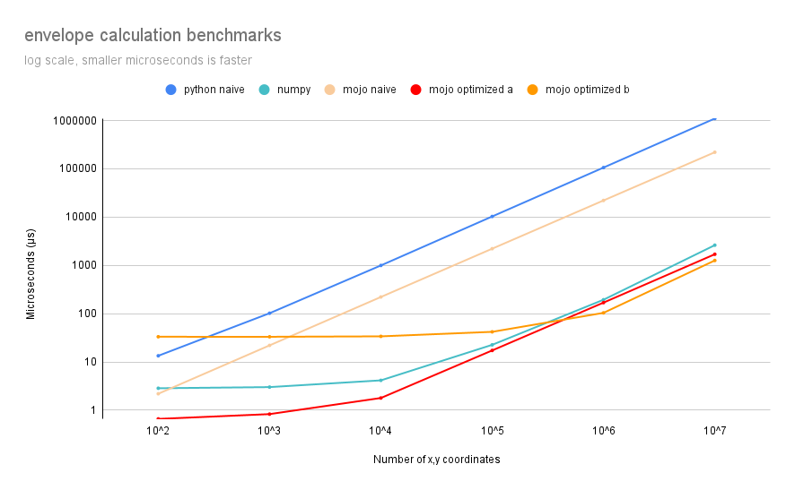
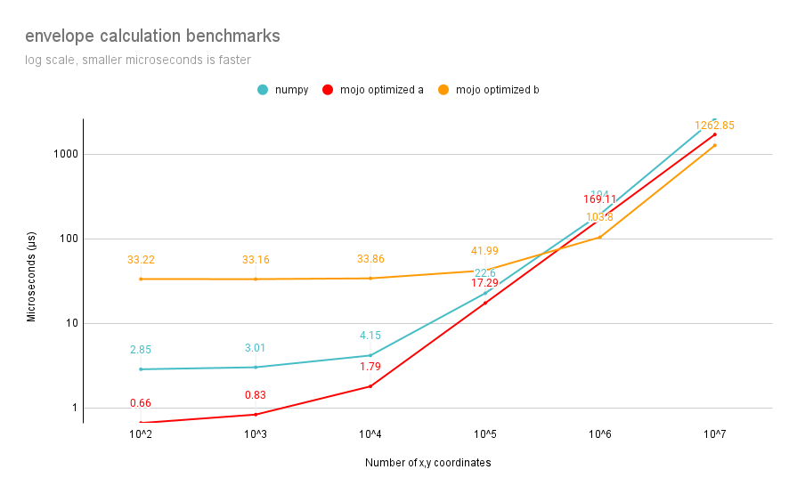

# Spatial envelope optimization and benchmarks

A [Mojo](https://github.com/modularml/mojo)🔥 project calculating the spatial envelope, and exploring the
performance of Python, Numpy, and Mojo.

## Envelope

Calculating an envelope is a fundamental part of spatial analysis. The envelope
(aka: bounds, bbox, mbr) is usually defined by an xmin, ymin, xmax, and ymax
representing the minimum and maximum x (longitude) and y (latitude) coordinates
that encompass the bounded feature(s).

Figure attribution: [QGIS documentation](https://docs.qgis.org/3.28/en/docs/user_manual/processing_algs/qgis/vectorgeometry.html#bounding-boxes): Fig. 27.53 Black lines represent the bounding boxes of each polygon feature.

## Variants benchmarked

- naïve Python
- naïve Mojo
- [NumPy](https://numpy.org/) optimized Python
- Mojo optimized with vectorization and loop unrolling, single-threaded (mojo optimized "a")
- Mojo optimized with parallelization, vectorization and loop unrolling. (mojo optimized "b")

## All benchmarks

Test system: mojo `0.5.0` on Apple M2, 24GB RAM. Data type: `float32`.

## Optimized variants only

## Key Findings

1. [Mojo optimized "a"](./mojo_impl/optimized_a.mojo) is the best overall
performer, but for large feature spaces (millions of points) by adding an
additional thread per dimension we can get about an additional 25% speedup as
shown in [Mojo optimized "b"](./mojo_impl/optimized_b.mojo).

2. In addition to the performance gains, the Mojo versions are parameterized by
the number of dimensions (`dims`) and by data type (`dtype`). In other words,
the same code can run with for example, `float16`, `float64` or with 3 or 4 or
more dimensions. In GIS systems this commonly referred to as XY, XYZ, or XYZM,
where Z is "height", and M is "measure".
